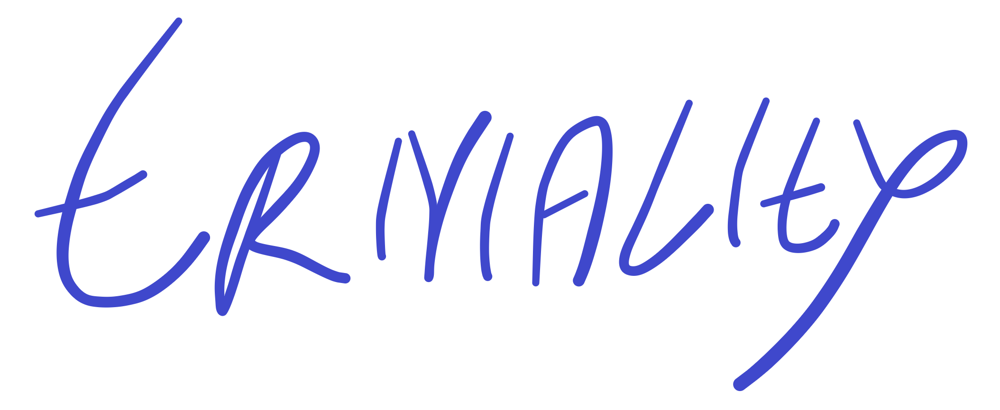

Triviality is a basic trivia application written in typescript using libraries such as Material UI, Redux, and axios. Triviality leverages the [Open Trivia Database](https://opentdb.com/api_config.php) API to generate questions.

The application is available at https://kevindmorris.github.io/triviality/.
